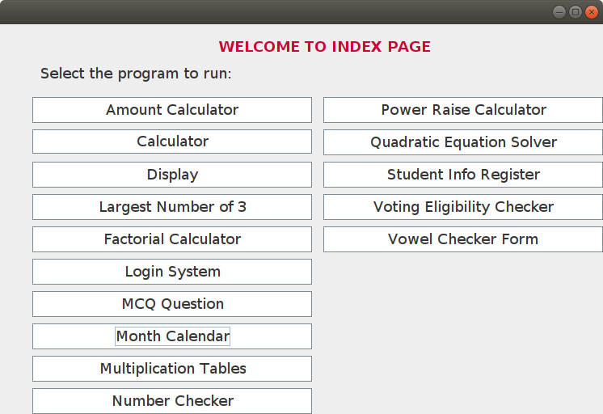

# Swing-API-Programs

This is a Java SE Standalone Desktop Application built using Swing API, and contains basic GUI based programs.

## Getting Started

The Screenshot of the GUI application Index Page :

### Prerequisites

The application is platform Independent and requires Java [JRE](https://docs.oracle.com/goldengate/1212/gg-winux/GDRAD/java.htm#BGBFJHAB) setup on the Local Machine to run.

### Installing

For Development purposes,Download and place the project repo on target system, that's it. Netbeans IDE can be used to open & work in the project.

## Deployment

For Deployment Purposes, **dist** folder needs to be setup on target machine. Then, **SwingAPIPrograms.jar** inside **dist** folder is the executable file.

## Built With

* [Swing API](https://docs.oracle.com/javase/8/docs/technotes/guides/swing/index.html) - Java API used
* [Netbeans](https://www.oracle.com/technetwork/java/javase/downloads/jdk-netbeans-jsp-3413139-esa.html) - Netbeans with Java SE

## Authors

 * **Jaskirat Singh**

## License

This project is licensed under the Apache2 License - see the [LICENSE.md](LICENSE) file for detail

